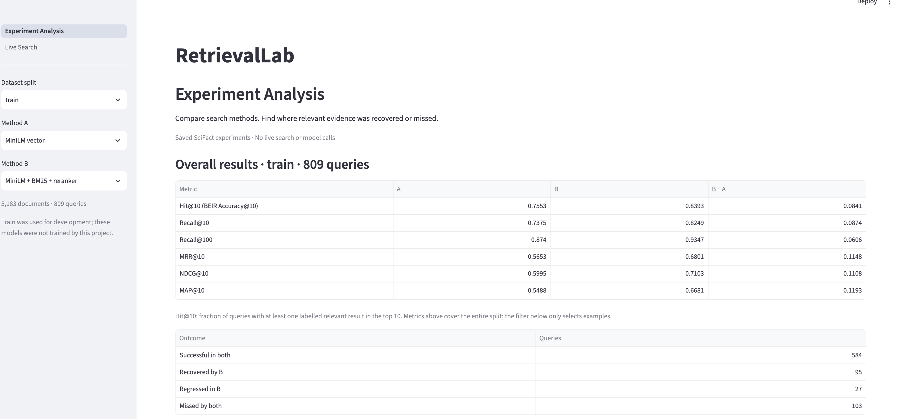
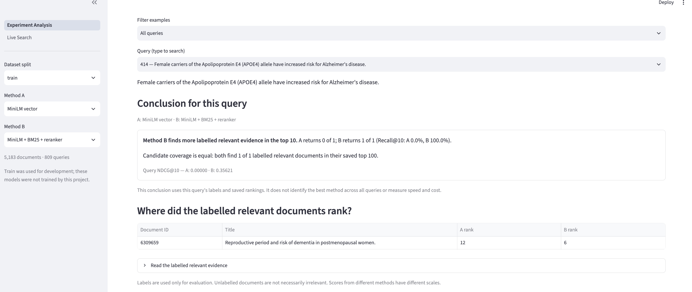
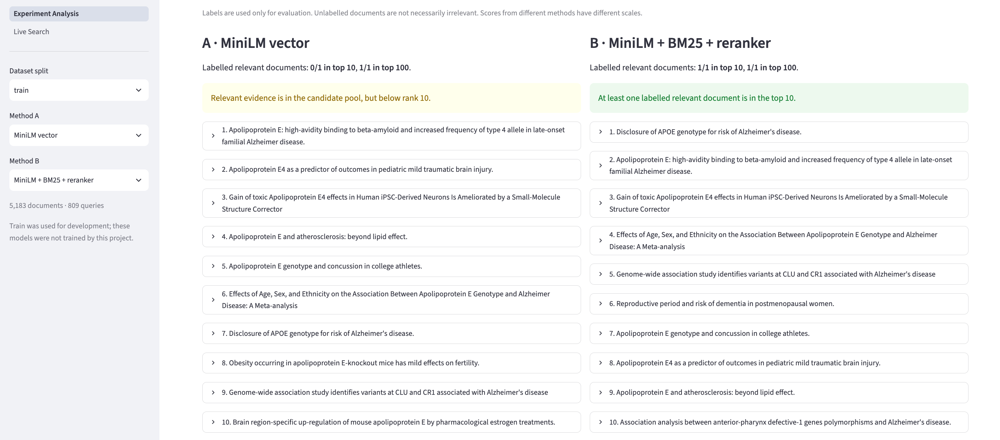
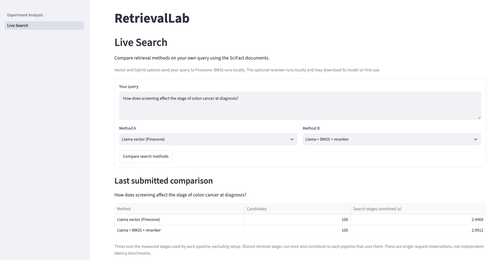
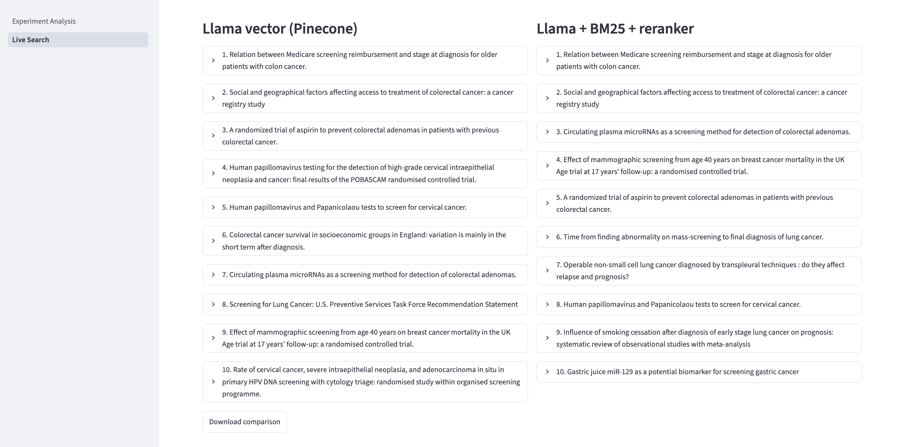
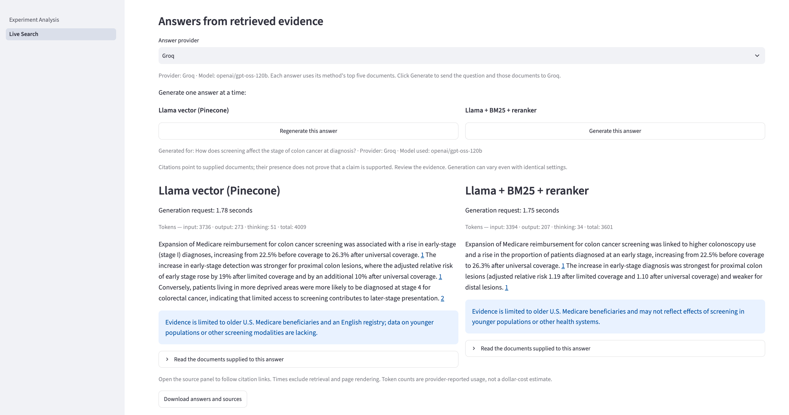
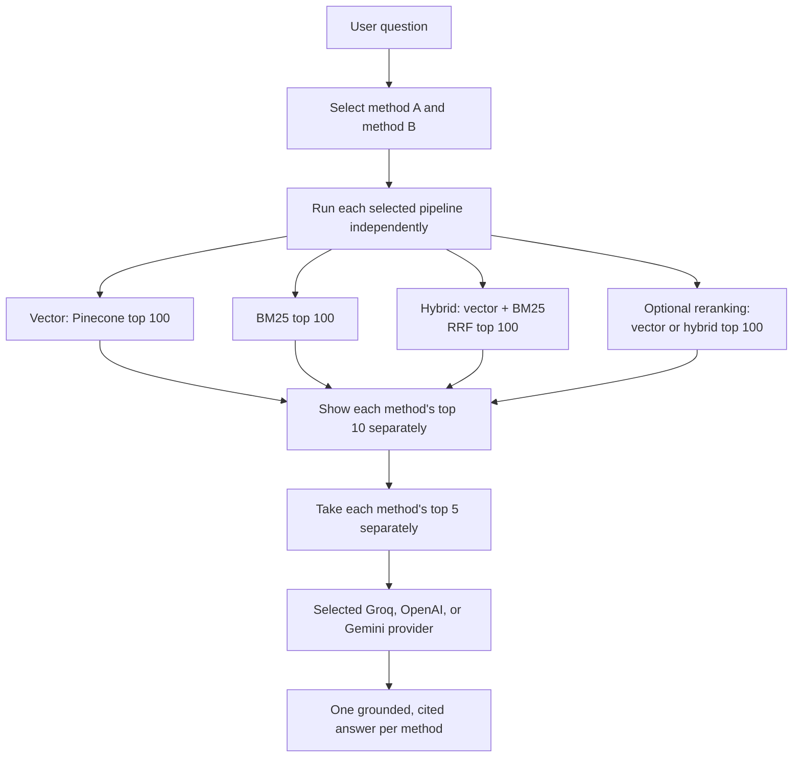

# RetrievalLab

RetrievalLab is an end-to-end information retrieval and retrieval-augmented generation (RAG) project built with the SciFact scientific claim verification dataset.

I built this project to study a common retrieval failure: a relevant document exists in the collection but does not appear in the top results. The project compares keyword, vector, hybrid, and reranking pipelines, evaluates them with standard BEIR metrics, and shows how retrieval quality affects a generated answer.

## Live demo

**Deployment:** Streamlit Community Cloud  
**Live application:** Coming soon


## What I built

- Dense retrieval with `multi-qa-MiniLM-L6-cos-v1`
- BM25 keyword retrieval
- Hybrid retrieval using Reciprocal Rank Fusion (RRF)
- Cross-encoder reranking with `cross-encoder/ms-marco-MiniLM-L6-v2`
- Cloud vector retrieval using Pinecone and `llama-text-embed-v2`
- BEIR evaluation for Accuracy/Hit, Recall, Precision, MRR, NDCG, and MAP
- Train/test experiment tracking using saved top-100 rankings
- A Streamlit interface for experiment analysis and live retrieval
- Evidence-grounded answers using Groq, OpenAI, or Gemini
- Inline source citations, latency and token reporting, and safe API retry handling

## How the application works

The application has two pages.

### Experiment Analysis

This page uses the saved rankings and SciFact relevance labels to:

- Compare two retrieval methods across the train or test split
- Inspect overall BEIR metrics
- Find queries recovered or regressed by a method
- See where each labelled relevant document ranked
- Compare the top results from both methods




### Live Search

This page lets a user enter a custom question and select Method A and Method B. The selected pipelines run independently and display their top results side by side.

For answer generation, each method supplies its own top five documents to the selected Groq, OpenAI, or Gemini model. Therefore, the application produces one evidence-grounded answer for each retrieval method.

Custom questions do not have relevance labels, so the Live Search page does not claim that one method is more accurate. It allows the user to inspect the retrieved evidence and answers directly.




## Architecture



Only the selected pipelines run. Shared vector or BM25 calculations may be reused internally, but their final rankings remain separate. Vector and BM25 rankings are fused only when a hybrid method is selected.

Reranking only reorders documents already present in a candidate pool. It cannot recover a relevant document that was not retrieved into that pool.

## Retrieval methods

| Method | Description |
|---|---|
| MiniLM vector | Local semantic retrieval using exact cosine similarity |
| BM25 | Keyword retrieval based on term frequency and rarity |
| MiniLM + BM25 | RRF fusion of the MiniLM and BM25 top-100 rankings |
| MiniLM + BM25 + reranker | Cross-encoder reranking of the MiniLM hybrid candidates |
| Llama vector (Pinecone) | Cloud vector retrieval using Pinecone integrated embeddings |
| Llama + reranker | Cross-encoder reranking of the Pinecone candidates |
| Llama + BM25 | RRF fusion of the Pinecone and BM25 rankings |
| Llama + BM25 + reranker | Cross-encoder reranking of the Llama/BM25 hybrid candidates |

RRF combines document ranks rather than incompatible BM25 and cosine scores:

```text
RRF score(document) = Σ 1 / (60 + rank)
```

## Dataset

RetrievalLab uses the [SciFact](https://github.com/allenai/scifact) dataset:

- 5,183 scientific documents containing titles and abstracts
- 809 train queries
- 300 test queries
- Qrels identifying the labelled relevant evidence for each query

Qrels are used only after retrieval to evaluate the results. They do not influence the search ranking. The train split was used for development and analysis; the final results were measured on the test split. The embedding and reranking models are pretrained models and were not trained by this project.

## Test results

BEIR evaluation on the 300-query SciFact test split:

| Method | Hit@10 | Recall@10 | Recall@100 | MRR@10 | NDCG@10 | MAP@10 |
|---|---:|---:|---:|---:|---:|---:|
| MiniLM vector | 0.66667 | 0.65011 | 0.88033 | 0.51342 | 0.54029 | 0.49919 |
| BM25 | 0.79667 | 0.77400 | 0.87306 | 0.61862 | 0.65189 | 0.60697 |
| MiniLM + BM25 | 0.79667 | 0.77878 | 0.93033 | 0.60768 | 0.64179 | 0.59278 |
| MiniLM + BM25 + reranker | 0.82000 | 0.80556 | 0.93033 | 0.65753 | 0.68685 | 0.64254 |
| **Llama vector (Pinecone)** | **0.86000** | **0.84933** | 0.94200 | **0.69548** | **0.72577** | **0.68086** |
| Llama + reranker | 0.84667 | 0.83322 | 0.94200 | 0.66088 | 0.69543 | 0.64637 |
| Llama + BM25 | 0.84667 | 0.83189 | **0.95867** | 0.67434 | 0.70830 | 0.66323 |
| Llama + BM25 + reranker | 0.83667 | 0.82322 | **0.95867** | 0.66094 | 0.69327 | 0.64615 |

### Findings

- Llama vector search achieved the strongest top-10 test results.
- Llama + BM25 achieved the highest candidate coverage at Recall@100.
- Reranking improved the MiniLM hybrid pipeline but reduced the Llama-based results.
- Hybrid retrieval increased candidate coverage, but it did not always improve the ordering of the first 10 results.
- Pinecone and the Llama embedding model were introduced together, so the performance increase cannot be attributed to the vector database alone.

## Technology stack

- Python 3.11
- uv
- BEIR
- Sentence Transformers
- rank-bm25
- Pinecone
- Streamlit
- Gemini API
- OpenAI API
- Groq API

## Project structure

```text
retrievallab-project/
├── app.py
├── retrievallab/
│   ├── __main__.py
│   ├── core.py
│   ├── pinecone_io.py
│   └── runner.py
├── tests/
├── datasets/scifact/
├── results/
├── docs/images/
├── .env.example
├── pyproject.toml
└── uv.lock
```

## Run locally

The deployed application is the easiest way to try the complete project.

To run locally, clone the repository and install the locked dependencies:

```bash
uv sync
```

Create a local environment file:

```bash
cp .env.example .env
```

Add your own credentials to `.env`:

```dotenv
PINECONE_API_KEY=your_pinecone_api_key
GEMINI_API_KEY=your_gemini_api_key
GEMINI_MODEL=gemini-3.8-flash
OPENAI_API_KEY=your_openai_api_key
OPENAI_MODEL=gpt-5-mini
GROQ_API_KEY=your_groq_api_key
GROQ_MODEL=openai/gpt-oss-120b
```

Then start the application:

```bash
uv run streamlit run app.py --server.fileWatcherType none
```

Pinecone credentials are required only for Pinecone-based live retrieval. Groq, OpenAI, and Gemini keys are required only when the corresponding answer provider is selected. Local users must provide their own credentials and compatible external services; the project owner's keys are never shared.

## Run tests

```bash
uv run python -m unittest discover -s tests -v
uv run python -m compileall -q app.py retrievallab tests
```

Evaluate a saved test ranking:

```bash
uv run python -m retrievallab evaluate \
  --split test \
  --input results/llama_pinecone_test.json
```